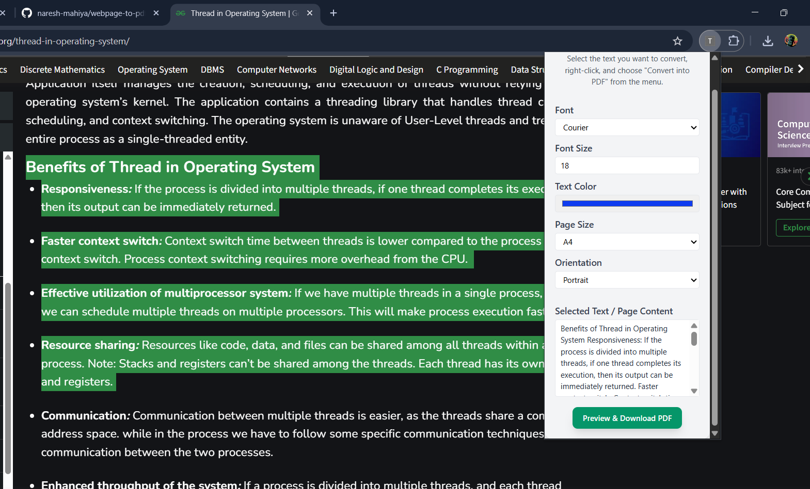

# 🚀 Text to PDF Converter Chrome Extension

A Chrome extension that allows users to convert selected webpage text content into PDF format with custom styling—completely client-side, with no backend required.

## ✨ Features

- Convert selected text  content to PDF
- Choose font, font size, text color, page size, and orientation
- Preview PDF before downloading
- Custom filename support
- Modern and minimal user interface
- 100% frontend: no server or backend needed
- Simple and intuitive workflow

## 📸 Screenshots

### Extension Popup

*Modern popup interface with styling controls and PDF preview*

### Context Menu

*Right-click menu showing PDF conversion option*

### Download preview

*Download preview of pdf in popup*

### PDF Generation

*ownload PDF with custom filename*

## 📁 Project Structure

```
project/
└── frontend/               # Chrome Extension files
    ├── manifest.json      # Extension configuration
    ├── popup.html         # Extension popup UI
    ├── popup.js           # Popup logic
    ├── background.js      # Background script for context menu
    ├── libs/              # Local jsPDF and html2canvas
    ├── icons/             # Extension icons
    ├── .gitignore         # Git ignore file
    └── ...
```

## 🔧 Installation

1. **Chrome Extension Setup**:
   - Open Chrome browser
   - Go to `chrome://extensions/`
   - Enable "Developer mode" (toggle in top-right corner)
   - Click "Load unpacked"
   - Select the `frontend` folder

## 📝 Usage

1. **Convert Selected Text**:
   - Select the text you want to convert
   - Right-click and choose "Convert into PDF" from the context menu
   - The extension popup will open with your selected text
   - Choose font, size, color, page size, and orientation as desired
   - Click "Preview & Download PDF" to preview
   - Click "Download PDF" to save with your custom filename


## 💻 Technical Details

**Chrome Extension APIs:**
- Built on `Chrome Extension Manifest V3`
- Uses `chrome.contextMenus` API for right-click menu integration
- Uses `chrome.storage` API for passing selected content
- `chrome.runtime.onMessage` & `chrome.runtime.sendMessage`: Enables communication between      background scripts and the popup for passing selected content.
- `chrome.action.openPopup`: Programmatically opens the popup when the context menu is used.
- All PDF generation is done client-side using `jsPDF` and `html2canvas` (loaded locally)
- No backend or server is required—everything runs in the browser
- Modern popup UI with Tailwind CSS

 **PDF Generation:**
  - `jsPDF` (UMD build): Generates PDFs entirely in the browser, supports custom fonts, sizes, colors, and page layouts.
  - `html2canvas`: (Prepared for future use) Can render HTML elements as images for PDF embedding.

- **JavaScript/Browser Features:**
  - `window._currentPdfDoc`: Stores the currently previewed jsPDF document for on-demand download.
  - `prompt()`: Used for custom filename input before saving the PDF.
  - Dynamic DOM manipulation: For previewing PDFs and managing UI state.


## ⚠️ Troubleshooting

1. **Extension not working**:
   - Verify extension is properly loaded
   - Check Chrome's console for errors

2. **PDF generation fails**:
   - For very large webpages, try selecting smaller sections of text
   - If you see blank or broken PDFs, try changing font size or page orientation

## 🤝 Contributions

Feel free to contribute to this project! You can:
- Add new features like batch processing or cloud storage
- Improve the UI/UX design
- Fix bugs or optimize performance
- Add support for more languages

Just fork the repo, make your changes, and submit a pull request!

