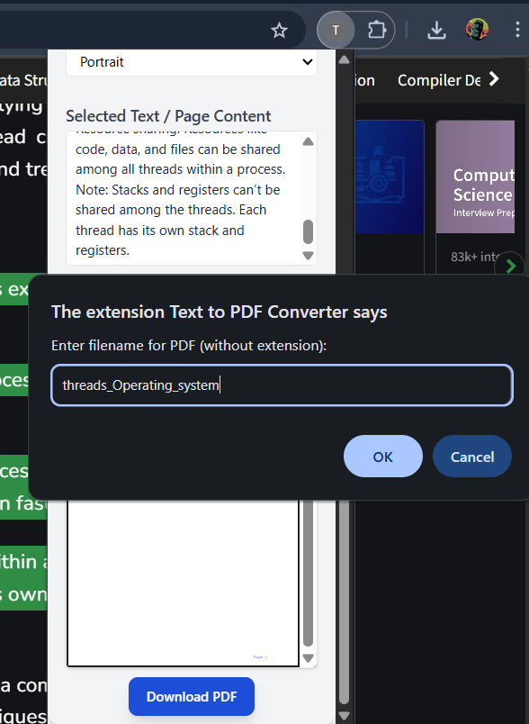

# 🚀 Text to PDF Converter Chrome Extension

A Chrome extension that allows users to convert selected webpage text or entire page content into PDF format with custom filenames.

## ✨ Features

- Convert selected text to PDF
- Convert entire webpage to PDF
- Custom filename support
- Clean and minimal user interface
- View all generated PDFs
- Simple and intuitive workflow

## 📸 Screenshots

### Extension Popup

*Clean and minimal popup interface with View All PDFs button*

### Context Menu

*Right-click menu showing PDF conversion options*

### PDF Generation

*Prompt for custom filename when generating PDF*

### All PDFs View

*List of all generated PDFs with download options*

### Extension Store

*Extension available in Chrome Web Store*

## 📁 Project Structure

```
project/
├── frontend/           # Chrome Extension files
│   ├── manifest.json  # Extension configuration
│   ├── popup.html     # Extension popup UI
│   └── background.js  # Background service worker
└── backend/           # Node.js server
    ├── server.js      # Express server
    ├── package.json   # Backend dependencies
    ├── views/         # EJS templates
    │   └── allpdfs.ejs # PDF listing page
    └── pdfs/          # Generated PDF storage
```

## 🔧 Installation

1. **Backend Setup**:
   ```bash
   cd backend
   npm install
   npm start
   ```
   The server will run on `http://localhost:5000`

2. **Chrome Extension Setup**:
   - Open Chrome browser
   - Go to `chrome://extensions/`
   - Enable "Developer mode" (toggle in top-right corner)
   - Click "Load unpacked"
   - Select the `frontend` folder

## 📝 Usage

1. **Convert Selected Text**:
   - Select the text you want to convert
   - Right-click and choose "Convert into pdf" from the context menu
   - Enter a filename when prompted
   - The PDF will be generated and downloaded automatically

2. **Convert Entire Page**:
   - Right-click anywhere on the page
   - Choose "Convert into pdf" from the context menu
   - Enter a filename when prompted
   - The PDF will be generated and downloaded automatically

3. **View All PDFs**:
   - Click the extension icon
   - Click "View All PDFs" to see all generated PDFs

## 💻 Technical Details

### Frontend (Chrome Extension)
- Built on `Chrome Extension Manifest V3` with service worker architecture
- Uses `chrome.contextMenus` API for right-click menu integration
- Implements `chrome.scripting` API for content script injection
- Leverages `chrome.storage` API for local settings management
- Handles text selection and conversion through background service worker
- Provides minimal popup interface with `HTML5/CSS3`

### Backend (Node.js Server)
- **Server Framework**: `Express.js`
  - RESTful API endpoints
  - CORS enabled for extension communication
  - Body parsing for JSON data
- **PDF Generation**:
  - `PDFKit` for PDF creation
  - Customizable page settings
  - Text formatting preservation
- **File Management**:
  - Secure file storage
  - Unique filename generation
  - PDF directory organization
- **View Engine**: `EJS`
  - Dynamic PDF listing page
  - Responsive table layout
  - Download links generation

## 📦 Dependencies

### Backend
- express: ^4.19.2
- cors: ^2.8.5
- body-parser: ^1.20.2
- pdfkit: ^0.15.0
- ejs: ^3.1.10

## 📌 Notes

- The backend server must be running for the extension to work
- PDFs are stored in the backend's `pdfs` directory
- The extension communicates with `localhost:5000`
- All generated PDFs can be viewed through the extension's popup

## ⚠️ Troubleshooting

1. **Extension not working**:
   - Check if backend server is running
   - Verify extension is properly loaded
   - Check Chrome's console for errors

2. **PDF generation fails**:
   - Ensure backend server is accessible
   - Check network connectivity
   - Verify sufficient disk space
   - For large webpages, try selecting smaller sections of text
   - If the page is too large, the conversion might fail due to memory constraints

3. **View All PDFs not working**:
   - Ensure backend server is running
   - Check if PDFs directory exists
   - Verify proper permissions 